# Architecture

qi turns any directory into a searchable knowledge base — no servers, no infrastructure, no cloud dependencies. Everything lives in a single SQLite file at `~/.local/share/qi/qi.db`: indexed content, embeddings, cached responses. The system meets you where you are: BM25 full-text search works immediately with zero configuration, vector search activates when you point qi at an embedding model, and LLM-powered Q&A unlocks when you add a generation provider. Each tier builds on the last.

## Diagram

## Indexing

Indexing is fast because qi only processes what has changed. Every file is fingerprinted with SHA-256 on the way in — if the hash matches what's already stored, the file is skipped instantly. No parsing, no disk I/O beyond the read. This is content-based detection, so a file with a forged mtime still gets caught.

For new or changed files, qi runs a three-stage pipeline:

1. **Parse** — files are broken into sections by structure. Markdown splits at headings; plaintext and source code are treated as a single section. Parsers are registered by extension, so adding a new format is one file and one function call — nothing else changes.

2. **Chunk** — sections are split into chunks using a break-point scorer that understands document structure. Headings score 100, code fences 80, blank lines 20 — with a distance decay that prevents premature splits. Chunks stay semantically coherent instead of cutting mid-thought at an arbitrary byte count.

3. **Store** — content is written to a SHA-256-keyed blob store, so two collections indexing the same file share a single copy. Chunks land in a transaction; SQLite triggers keep the full-text index in sync automatically. Embeddings are generated in a separate pass after the transaction commits, so a provider hiccup never rolls back successfully indexed text.

Files that disappear from disk are soft-deleted rather than erased. Index history stays intact. Hard deletion is always explicit, through `qi delete`.

## Search

Every query runs BM25 first. The query is sanitized — punctuation stripped, stop-words removed, each token quoted — then matched against a Porter-stemmed FTS5 index. Up to 50 candidates come back ranked by relevance.

From there, qi makes a fast decision:

- **Strong lexical signal** — if the top BM25 score is more than 3× the second, the answer is clear and vector search is skipped. No embedding round-trip, no latency.
- **Hybrid mode** — otherwise, the query is embedded and compared against stored chunk vectors using cosine distance. Results from both passes are merged with Reciprocal Rank Fusion: each result scores `Σ 1/(60 + rank)` across both lists. RRF doesn't care that BM25 and cosine scores live on different scales — rank position is all that matters.

The result is search that's precise when the keyword match is obvious, and semantically aware when it isn't.

## Q&A

`qi ask` turns your index into a private research assistant. It retrieves context the same way as `qi query`, then:

1. Assembles the top 10 passages into a prompt. Each passage carries a `qi://collection/path` URI so the model can cite its sources precisely.
2. Checks a response cache keyed by `SHA-256(model + prompt)`. A repeated question costs nothing — no API call, no wait.
3. Calls the generation provider, streams back the answer, and caches it for next time.

The cache key covers both the model and the full prompt content. Change the model, change the retrieved context, change the question — the cache busts automatically.

## Database Schema

One file. Every table in `internal/db/migrations/001_init.sql`. WAL mode enabled.

| Table | Purpose |
|---|---|
| `content` | Content-addressable blob store keyed by SHA-256. A file indexed by multiple collections is stored exactly once. |
| `documents` | One row per file per collection — path, title, content hash, active status. |
| `chunks` | Text segments with sequence number, heading breadcrumb, and byte offset. |
| `chunks_fts` | FTS5 virtual table mirroring chunk text. Trigger-maintained — the app never writes to it directly. |
| `chunk_vectors` | Embedding vectors as little-endian `float32` BLOBs. |
| `embeddings` | Provider, model, and dimension metadata for each embedded chunk. |
| `collections` | Named collections from config or `qi index --name`. |
| `index_runs` | Full audit log of every indexing run: file counts, timestamps, errors. |
| `llm_cache` | Cached LLM responses keyed by `SHA-256(model + "\x00" + prompt)`. |

## Under the Hood

**Zero build dependencies** — qi uses `github.com/ncruces/go-sqlite3`, which transpiles the SQLite amalgamation to Go via wasm2go. No CGo, no C toolchain, no cross-compilation friction. `go install` and you're done.

**In-memory vector search** — `sqlite-vec` would be the natural fit for KNN inside SQLite, but it depends on an older wazero-based runtime that the current `go-sqlite3` no longer uses. Until that's resolved, vectors are loaded into memory and scored with pure-Go cosine distance. Fast enough for local corpora, and it keeps the binary self-contained.

**No framework for config** — config is raw YAML via `gopkg.in/yaml.v3`. Tilde expansion and relative paths are resolved manually. Simple by design.

## Related Docs

- [`docs/configuration.md`](configuration.md) — all config fields with examples
- [`docs/config.example.yaml`](config.example.yaml) — fully annotated config file
- [`docs/named-collections.md`](named-collections.md) — named collections guide
